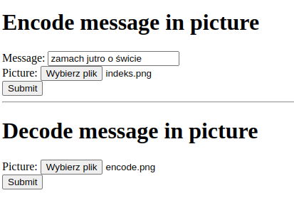

# Steganography toolkit

Homework project for cryptography classes at university.

## Supported actions
- Encode messages in JPEGs by appending them to the file past the image data
- Encode messages in any losslessly-compressed image format by encoding their bytes as base-four numbers represented by pixel color differences
- Decode so hidden messages

## Web GUI screenshot
